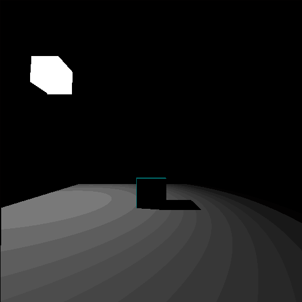

```
Windows
Depends on MinGW version x86_64-12.2.0-release-posix-seh-ucrt-rt_v10-rev2
MSVC is not suported, but should work
How to build and run?
cd tests/LevelFinal
build
run

Linux
Depends on GCC
How to build and run?
cd tests/LevelFinal
bash build.bash
bash run.bash
```

```c
#include "SysHelper.h"
#include "Window3D.h"

int main()
{
    Window3DInit(700, 100, 512, 512);

    Camera camera;
    camera.position = (Vector3){ 0, 1.70f, -10 };
    camera.yaw = 0;
    camera.pitch = 0;

    Window3DSetCamera(camera);

    while (Window3DExists())
    {
        SysHelperFixedTimeStart();
        Window3DDrawStart();

        Vector3 v0 = { +5, 0, +5 };
        Vector3 v1 = { +5, 0, -5 };
        Vector3 v2 = { -5, 0, -5 };
        Vector3 v3 = { -5, 0, +5 };
        Window3DDrawPoligon(v0, v1, v2, v3, COLOR_WHITE);

        Vector3 p0 = { 0, 0.5f, 0 };
        Window3DDrawCubeColored(p0, Vector3Zero(), Vector3One());

        float time = (float)SysHelperGetTime() / 1000;
        float x = MathSin(time) * 4;
        float z = MathCos(time) * 4;
        Vector3 lightPosition = { x, 5, z };
        Window3DApplyLightAndShadows(lightPosition);
        Window3DDrawCube(lightPosition, Vector3Zero(), Vector3One(), COLOR_WHITE);

        Window3DDrawEnd();
        SysHelperFixedTimeEnd();
    }

    return 0;
}

```

